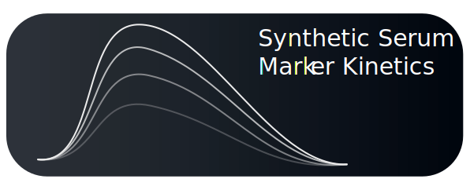

<h1 align="center">
    <a href="https://szablowskilab.github.io/rma-kinetics/docs">
        
    </a>
</h1>

[](https://crates.io/crates/rma-kinetics)

## RMA Kinetics: Synthetic Serum Reporter Kinetic Models and Analysis Tools

RMA Kinetics is a Rust and Python library of synthetic serum reporter models,
specifically for Released Markers of Activity or RMAs.

The core models include:

- Constitutive: constitutively expressed RMA
- Tet-Off: doxycycline indueced
- Chemogenetic: DREADD induced expression
- Oscillating: proxy for monitoring rapidly changing gene expression

Please see the [user guide](https://nsbuitrago.github.io/rma-kinetics-rs) to learn more.

## Installation

### Rust

The Rust crate is available on [crates.io](https://crates.io/crates/rma-kinetics). To install
the latest version with `cargo`:

```bash
cargo add rma_kinetics
```

Or add to your `Cargo.toml`

```
[dependencies]
rma_kinetics = "0.1.1"
```

## Python

The latest version on PyPI uses the old Python implementation.
To use the newer Python bindings, you can build them from source
using [maturin](https://www.maturin.rs/).

To get started, clone the repository and create a new virtual enviroment.:
In these examples, we use the [uv](https://docs.astral.sh/uv/) package manager.

```bash
git clone https://github.com/nsbuitrago/rma-kinetics-rs
cd rma-kinetics-rs

uv venv
```

Then, build the Python package with:

```bash
uvx maturin build --features py --release
```

For development:

```bash
uvx maturin develop --uv --features py -m crates/rma-kinetics/Cargo.toml
```

## Compile from Source

For development or other purposes, you may want to build from source.
The following steps describe how to compile the Rust and Python libraries:

1. Install the latest [Rust compiler](https://www.rust-lang.org/tools/install)
2. Install maturin: `pip install maturin`
3. Compile the Rust library: `cargo build --release`
3. Compile the Python library: `maturin build --features py --release `
